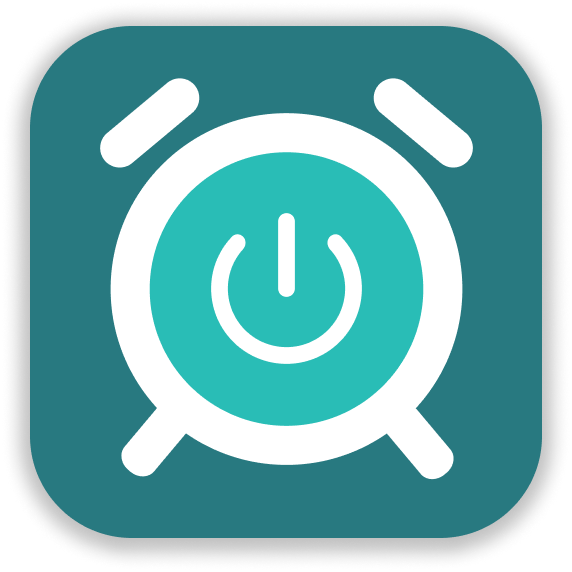
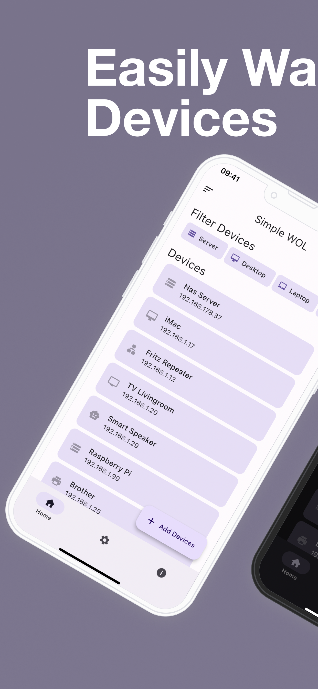
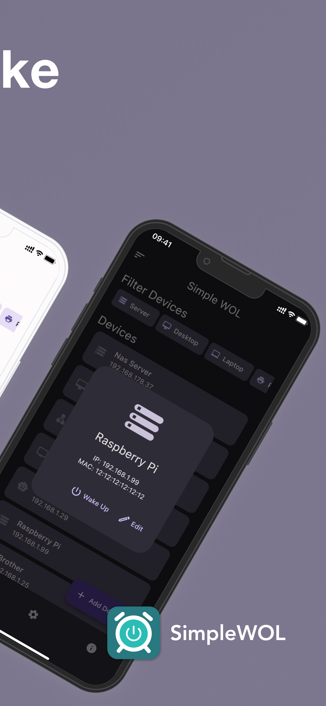
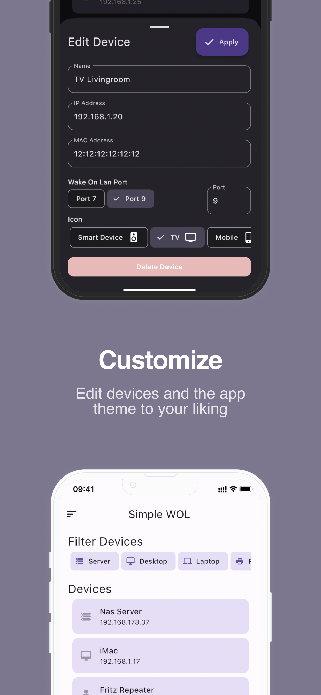
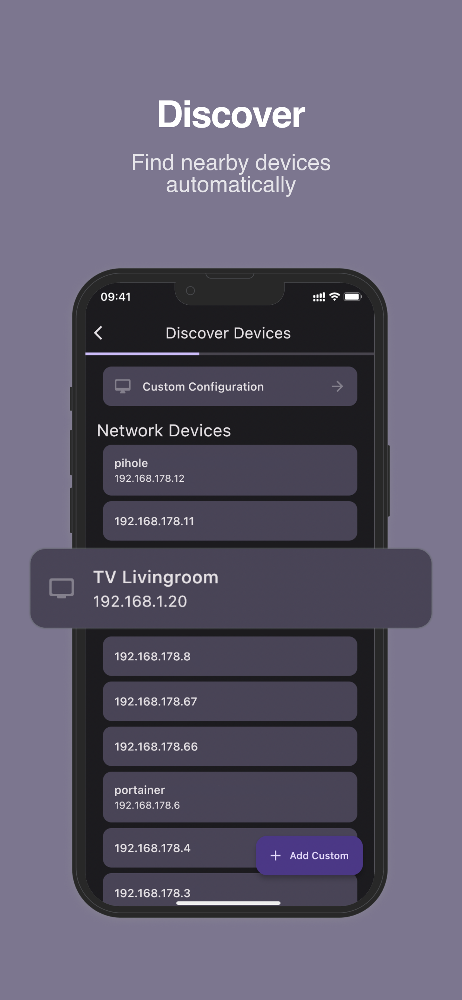

# SimpleWoL - Simple Wake on Lan

<!-- <a href="https://github.com/herzhenr/simple-wake-on-lan/actions/workflows/release-android.yml/badge.svg?branch=main"></a>
  <a href="https://github.com/herzhenr/simple-wake-on-lan/actions/workflows/release-ios.yml/badge.svg?branch=main"></a> -->

<p float="center">
  <a href="https://opensource.org/licenses/MIT"></a>
  <a href="https://flutter.dev"></a>
  <a href="https://www.dart.dev"></a>
  <a href="https://play.google.com/store/apps/details?id=com.henrikherzig.simplewol"></a>
  <a href="https://apps.apple.com/de/app/simple-wake-on-lan/id"></a>
  <a href="https://github.com/herzhenr/simple-wake-on-lan/actions/workflows/lint.yml"></a>
  <a href="https://github.com/herzhenr/simple-wake-on-lan"></a>
</p>

Simple Wake on Lan is a simple cross-platform flutter application for Android and iOS to send Wake On Lan packets to a
device.

<p align="center">
<a href="https://play.google.com/store/apps/details?id=com.henrikherzig.simplewol"></a>
&nbsp &nbsp
<a href="https://apps.apple.com/de/app/simple-wake-on-lan/id"></a>
</p>

## Usage
Wake on LAN (WoL) is a network protocol that allows a device to be turned on or awakened remotely
over a network while it is sleeping. This project aims to make the process of waking devices easy with a mobile application. 

<!--- by including features like automatic device discovery so the user does not have to enter details of a device they want to wake up manually, a simple interface to send the Wake On Lan packets and the possibility to export and import the user data as a `json` file. -->

## Screenshots


|                                          |                                     |
|:----------------------------------------:|:-----------------------------------:|
|  |  |  

|                                    |                                 |
|:----------------------------------:|:-------------------------------:|
|  |  |

## Features

- Automatic device discovery
- Simple interface to send Wake On Lan packets
- Export and import user data as a `json` file (see below)


The app stores the added devices in a `json` file which can be exported and imported within the app UI. An example of the file structure is shown below:
```json
[
  {
    "id": "6b353440-d183-11ed-964b-69a9facd6cfd",
    "hostName": "Raspberry Pi",
    "ipAddress": "192.168.1.9",
    "macAddress": "12:12:12:12:12:12",
    "wolPort": 9,
    "deviceType": "computer",
    "modified": "2023-04-14T14:17:45.974511"
  },
  {
    "id": "87c87ab0-d184-13ed-9d56-a5f550305985",
    "hostName": "Printer",
    "ipAddress": "192.168.1.10",
    "macAddress": "f0:f0:f0:f0:f0:f0",
    "wolPort": 9,
    "deviceType": "printer",
    "modified": "2023-04-14T14:18:14.997081"
  }
]
```

## Download

- You can download the latest version of the app from [GitHub Releases]()
- Download from the [PlayStore](https://play.google.com/store/apps/details?)
- Download from the [App Store](https://apps.apple.com/de/app/)

## Architecture
The app is built using the [Flutter](https://flutter.dev/) framework. It uses the [Material 3](https://m3.material.io) design system from Google.

## Build
To build the app yourself, you need to have the Flutter SDK installed. You can find the installation instructions [here](https://flutter.dev/docs/get-started/install).

## License
This project is licensed under the MIT License - see the [LICENSE](LICENSE) file for details

```License
Copyright (c) 2023 Henrik Herzig

Permission is hereby granted, free of charge, to any person obtaining a copy
of this software and associated documentation files (the "Software"), to deal
in the Software without restriction, including without limitation the rights
to use, copy, modify, merge, publish, distribute, sublicense, and/or sell
copies of the Software, and to permit persons to whom the Software is
furnished to do so, subject to the following conditions:

The above copyright notice and this permission notice shall be included in all
copies or substantial portions of the Software.

THE SOFTWARE IS PROVIDED "AS IS", WITHOUT WARRANTY OF ANY KIND, EXPRESS OR
IMPLIED, INCLUDING BUT NOT LIMITED TO THE WARRANTIES OF MERCHANTABILITY,
FITNESS FOR A PARTICULAR PURPOSE AND NONINFRINGEMENT. IN NO EVENT SHALL THE
AUTHORS OR COPYRIGHT HOLDERS BE LIABLE FOR ANY CLAIM, DAMAGES OR OTHER
LIABILITY, WHETHER IN AN ACTION OF CONTRACT, TORT OR OTHERWISE, ARISING FROM,
OUT OF OR IN CONNECTION WITH THE SOFTWARE OR THE USE OR OTHER DEALINGS IN THE
SOFTWARE.
```